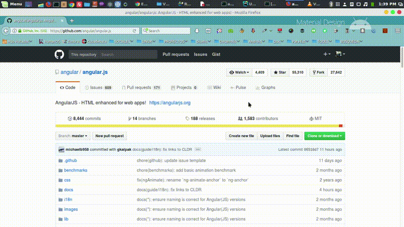

# UCI-GitHub


UCI-GitHub permite acceder a los recursos de GitHub, sin consumir cuenta de navegación, a través del Administrador de Repositorios http://nexus.prod.uci.cu
## Instalación
1. Instala **gulp** [http://gulpjs.com/](http://gulpjs.com/)
	```bash
	npm install gulp-cli -g
	npm install gulp -D
	```

2. Edita el fichero **gulpfile.js** para agregar archivos al complemento.

	```javascript
	'use strict';

	var gulp = require('gulp');
	var zip = require('gulp-zip');

	var files = ['manifest.json', 'jquery.min.js', 'jquery.msgBox.min.js', 	'jquery.msgBox.min.css', 'background.html', 'redirect.js', '*.svg', '*.png'];
	var xpiName = 'UCI-GitHub.xpi';

	gulp.task('default', function() {
    console.log(files, xpiName)
    gulp.src(files)
        .pipe(zip(xpiName))
        .pipe(gulp.dest('.'));
	});

	```
3. Crear la extención desde el terminal.
	```bash
    gulp
    ```


## Desarrollado por:
Adrian Arencibia Herrera ([https://humanos.uci.cu/author/aaherrera/](https://humanos.uci.cu/author/aaherrera/))
Ernesto Alejandro Santana ([https://humanos.uci.cu/author/nesty/](https://humanos.uci.cu/author/nesty/))